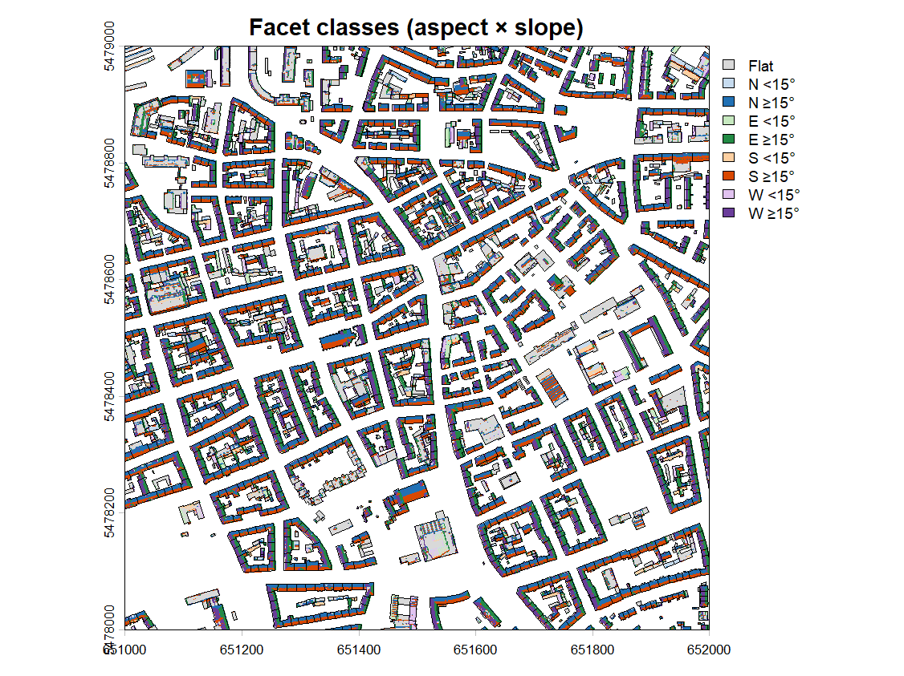
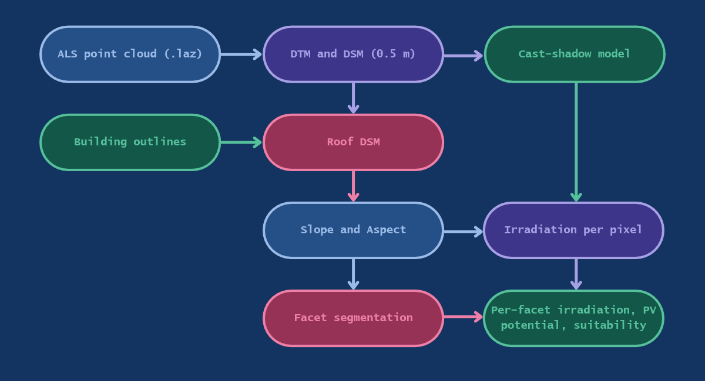
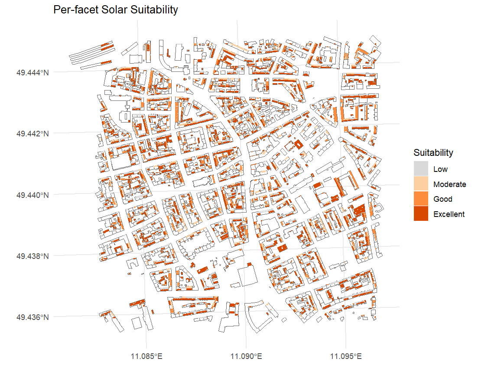

# Rooftop Solar Potential Mapping from Airborne LiDAR

Which roof surfaces are worth putting panels on? This project estimates annual solar irradiation **per roof facet** (not just per building) from open airborne laser scanning (ALS) data of Bavaria, using R and the `lidR` package. It accounts for roof pitch and orientation, and for shadows cast by neighbouring buildings.

  

*Roof facets of a 1 km × 1 km tile, classified by the compass direction they face and by how steep they are.*

<!-- Add your 3D render here once it is in images/:

  

-->

---

## Overview

Averaging slope and aspect over a whole building is misleading: a gable roof has a south-facing and a north-facing side that cancel out to a meaningless middle value. This workflow therefore:

1. splits every roof into its individual **facets** (pitches),
2. computes irradiation **per pixel** from each pixel's own slope, aspect and shading,
3. aggregates per facet and classifies suitability.

This is a course project (LiDAR course, Universität Würzburg).

## Study area and data

| Dataset | Description | Source |
|---|---|---|
| **Laserdaten** | Classified ALS point cloud, tile `651_5478` (1 km × 1 km, central Nuremberg, ~49.44° N, 11.09° E) | [Bayern OpenData](https://geodaten.bayern.de/opengeodata/OpenDataDetail.html?pn=laserdaten) |
| **Hausumringe** | Building outlines used to isolate roofs | [Bayern OpenData](https://geodaten.bayern.de/opengeodata/) |

Both datasets were accessed on 14.09.2026. Coordinate system: ETRS89 / UTM zone 32N (EPSG:25832). The data is not included in this repository, see [`data/README.md`](data/README.md) for how to get it.

## Method

  

| Step | What happens | Tools |
|---|---|---|
| **Surface models** | DTM from ground points (TIN); DSM with a pit-free algorithm, both at 0.5 m | `lidR` |
| **Roof isolation** | DSM masked to the building outlines | `terra`, `sf` |
| **Slope and aspect** | Derived from the roof DSM, lightly smoothed (3×3 median) for the irradiation calculation | `terra` |
| **Shadows** | Cast shadows from the *full* DSM (neighbouring buildings, chimneys, dormers) for every sun position used | `rayshader`, `suncalc` |
| **Irradiation** | Clear-sky direct and diffuse radiation on each tilted pixel; 12 representative days (15th of each month), hourly, weighted by days per month. Direct radiation is multiplied by the shadow mask | `solrad` |
| **Facet segmentation** | Aspect in 4 compass sectors, slope in flat / pitched, near-flat pixels get their own class (aspect is meaningless there), 3×3 majority filter against salt-and-pepper noise | `terra` |
| **Facet polygons** | Raster dissolved by value, multi-part polygons split into single facets, slivers below 8 m² dropped | `sf`, `terra` |
| **Suitability** | Mean irradiation per facet, PV potential = irradiation × area × panel efficiency (0.20) × performance ratio (0.80), four suitability classes | `sf`, `ggplot2` |

A detail worth knowing: `terra::patches()` (like `raster::clump()`) only separates regions by NA gaps, **not by value**. On a gap-free roof it merges all facets into one blob. Dissolving by value and exploding the multi-part polygons avoids this.

## Results

### Facet classes

The colour shows which way a roof pitch faces (blue = north, green = east, orange = south, purple = west). Saturated colours are pitches of 15° or more, pale colours are shallower, grey is flat.

### Solar suitability per facet

Mean irradiation per facet, classified from Low (grey) to Excellent (dark orange), drawn over the building outlines.

## Limitations

- **Clear-sky radiation.** `solrad` ignores cloud cover, so absolute values overestimate real irradiation. Treat the results as a relative ranking of roof surfaces, not as yield predictions.
- **Not yet calibrated or validated** against a reference such as PVGIS or the Energie-Atlas Bayern solar roof cadastre.
- **Diffuse radiation is not shaded**, only the direct beam.
- **Representative days** (one per month) smooth over day-to-day variation within a month.
- **Pixel-based facets.** Segmenting a 0.5 m raster gives noisy facet edges compared with fitting planes directly to the point cloud (for example with RANSAC).
- **Suitability classes are a modelling choice**, not an official standard.
- Heritage protection, roof structure, installation costs and similar constraints are not considered.

## Possible next steps

- Calibrate irradiation against PVGIS and classify relative to an optimally tilted surface
- Validate against the Energie-Atlas Bayern solar cadastre
- Add a usable-area fraction (setbacks, chimneys, skylights) and handle flat roofs with tilted racks
- Process further tiles in a loop

## Data attribution

Contains data from the Bayerische Vermessungsverwaltung ([geodaten.bayern.de](https://geodaten.bayern.de)), provided as open data under CC BY 4.0. Check the licence terms on the portal before reusing the data.
